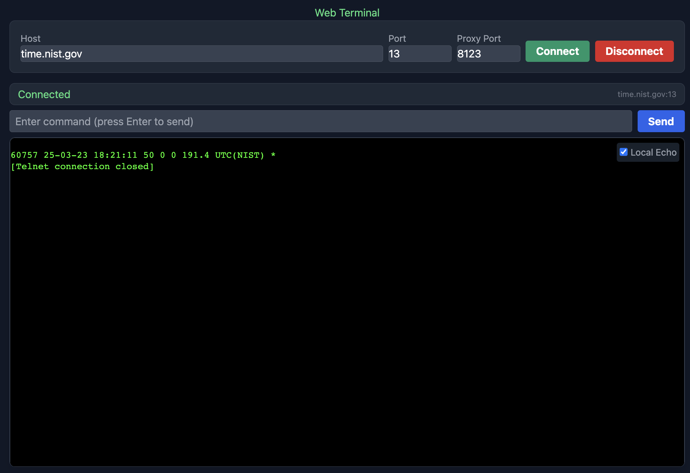

# Web Terminal
A browser-based terminal client that connects to remote servers via a WebSocket proxy. This lightweight application allows you to connect to any TCP-based service through a simple web interface.



## Features

- Connect to any host/port combination via WebSocket proxy
- Terminal emulation with xterm.js
- Local echo toggle
- Command history
- Responsive design
- Works with Telnet, SMTP, POP3, and any text-based TCP protocol

## Quick Start

### 1. Start the Web Server

You can run the frontend with a simple HTTP server:

```bash
# Navigate to the project directory
cd x-term-web

# Start a local web server with npx
npx http-server -c -1
```

This will serve the frontend at http://localhost:8080

### 2. Start the Proxy Server

In a separate terminal:

```bash
# Navigate to the server directory
cd web-terminal/server

# Install dependencies
npm install

# Start the server
npm start
```

The proxy server will run on port 8123 by default.

### 3. Use the Web Terminal

- Open http://localhost:8080 in your browser
- Enter a host and port (e.g., time.nist.gov and 13)
- The proxy port should already be set to 8123
- Click "Connect"

## File Structure

```
web-terminal/
├── index.html              # Main application
├── server/
│   ├── proxy-server.js     # WebSocket proxy server
│   └── package.json        # Server dependencies
└── README.md               # This file
```

## Local Development

### Frontend

Simply edit the index.html file. The application is self-contained in a single file for simplicity.

To reload changes:
- Save your edits
- Refresh the browser

### Proxy Server

The server depends on:
- `ws` for WebSocket support
- `nodemon` for development (auto-restart on changes)

To run the server in development mode with auto-reload:

```bash
cd server
npm run dev
```

## Connecting to Different Services

The Web Terminal can connect to various services:

- **Time Service**: time.nist.gov:13 
- **HTTP**: any-website.com:80 (try sending "GET / HTTP/1.0" followed by two enters)
- **SMTP**: mail-server.com:25
- **Other**: Any text-based TCP service

## Limitations

- No TLS/SSL support in the current proxy implementation
- No authentication support for protocols like SSH
- The proxy server must be running on localhost for the default configuration

## Customization

You can easily customize the terminal by editing the Terminal Configuration section in the index.html file:

```javascript
const TerminalConfig = {
  theme: {
    background: '#000000',
    foreground: '#00ff00',
  },
  fontSize: 14,
  // other options...
};
```

## License

MIT